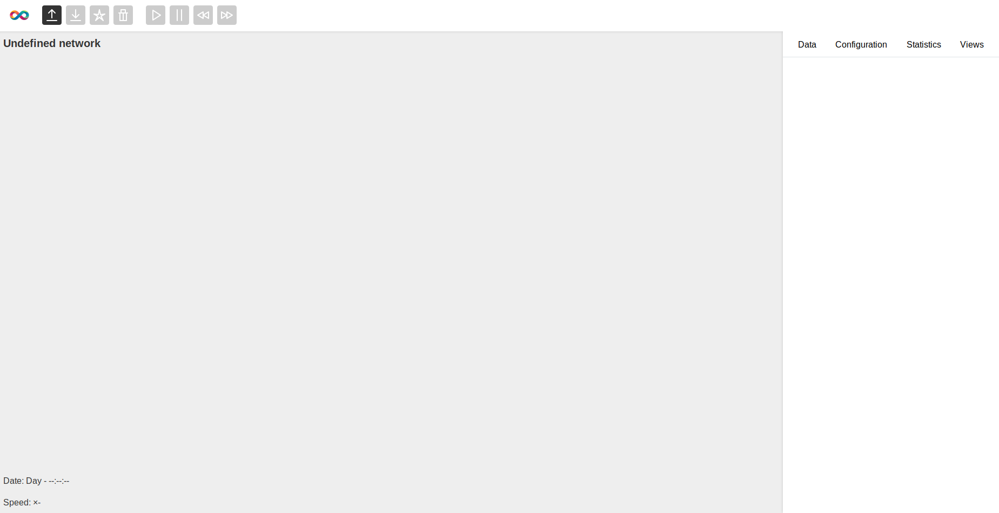
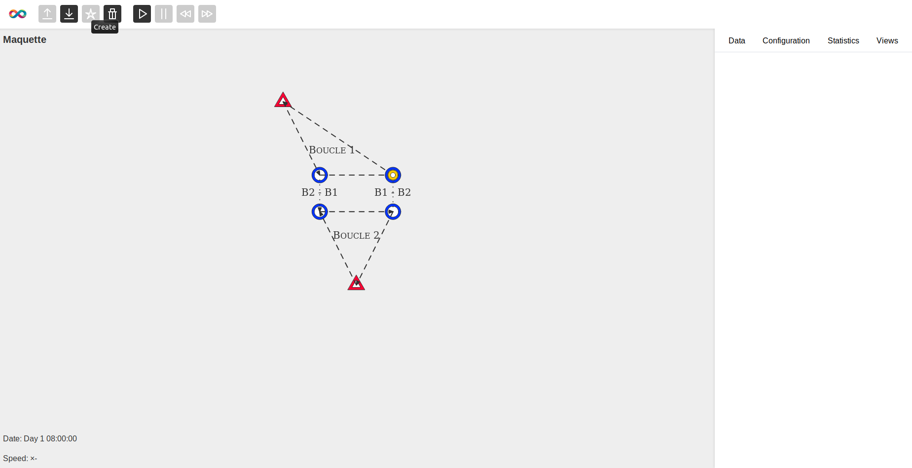
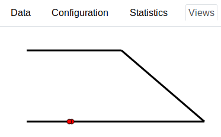

# Simulateur global *UrbanLoop*

* Projet Industriel 2018-2019 de Mlle ASSELIN-BOULLÉ M. CHOCOT et M. HENRY encadré par M. Thibault CHOLEZ dont l'objectif est de créer un simulateur du réseau des capsules *UrbanLoop*.

* Projet Interdisciplinaire de la Découverte de la Recherche (2019) avec M. Frédéric VENIER et M. Victor THEVENON encadré par M. Thibault CHOLEZ dont l'objectif est l'amélioration du simulateur grâce à l'ajout du paradigme *SDN* (*Software Defined Networking*).

* Stages de deuxième année à *Telecom Nancy* effectués par M. Tristan LE GODAIS et M. Malo MONGARD encadrés par M. Thibault CHOLEZ dont les objectifs principaux sont l'amélioration du simulateur avec notamment l'ajout de l'algorithme d'aiguillage réalisé lors d'un autre Projet Industriel. Ces stages ont amené une refonte complète du simulateur.

* Projet Industriel 2019-2020 de M. GAU M. OLIVIER et M. ALIBAY encadré par M. Thibault CHOLEZ dont l'objectif est de continuer le développement de la refonte du simultauer effectuée lors des précédents stages.

## Contexte

Ce projet s'inscrit dans l'étude de la faisabilité du projet *UrbanLoop* dont l'objectif est d'effectuer un fort remaniement des transports en commun en milieu urbain avec une application dans l'agglomération du *Grand Nancy*.

Le sous-projet présent est :

* à la demande de Monsieur Jean-Philippe MANGEOT ;
* encadré par Monsieur Thibault CHOLEZ ;
* effectué par les élèves ingénieurs de *TELECOM Nancy* suivants :
	* Charlotte ASSELIN-BOULLÉ ;
	* Baptiste CHOCOT ;
	* Thibault HENRY ;
	* Victor THEVENON ;
	* Frederic VENIER ;
	* Tristan LE GODAIS ;
	* Malo MONGARD ;
	* Valentin GAU ;
	* Antoine OLIVIER ;
	* Dylan ALIBAY.

Le projet de ce dépôt s'inscrit dans le cadre scolaire d'un Projet Industriel de 3ème année à *TELECOM Nancy*. Le sujet est *Simulation du réseau de transport urbain par capsules UrbanLoop*.

Le sujet du Projet Interdispiplinaire de Découverte de la Recherche est *Amélioration du système de routage du simulateur d’UrbanLoop grâce au paradigme SDN*.

Les sujets des stages effectués sur le simulateur sont :
* *Interfaçage du simulateur global du réseau UrbanLoop avec celui des postes d’aiguillage* ;
* *Consolidation et extension du simulateur UrbanLoop*.

Le sujet du Projet Industriel de 3ème année est *Extension et amélioration du simulateur du réseau Urbanloop*.

## Contenu

Ce dépôt comprend différents dossiers et fichiers correspondant à la réalisation d'une maquette numérique simulant le réseau accompagnée de son interface utilisateur. Les éléments sont répartis suivant différents dossiers :

* [`documentation`](documentation) contient les différents documents pertinents pour la compréhension du projet ;
* [`model`](model) contient la majorité des classes d'objets et des fonctions liées (*Python*) ;
* [`view`](view) regroupe les éléments de l'interface graphique (*HTML* / *CSS* / *SVG* / *ECMAScript*) ;
* [`controler`](controler) contient les fichiers permettant de gérer la simulation et le modèle probabiliste ;
* [`resources`](resources) contient des exemples de réseaux au format *JSON*.

## Usage

### Prérequis

* `python3.7`

### Dépendances

* `simpy`
* `flask`

### Lancement

Pour lancer le programme (après téléchargement des sources), exécuter la commande suivante :

```sh
$ python3.7 main.py -p
```

Il est aussi possible de charger des réseaux dès le lancement comme ceci :

```sh
$ python3.7 main.py -p -n '{"0": "path/to/network0.json", "42": "path/to/network42.json"}'
```

Pour plus d'informations, utilisez la commande suivante :

```sh
$ python3.7 main.py -h
```

### Utilisation

L'interface se présente de la façon suivante :



Pour visualiser un réseau il vous faut en charger un ; cliquez sur l'icône  puis sélectionnez le fichier *JSON* d'un réseau. Vous pouvez en avoir en exemple dans le dossier [`resources`](resources) de ce dépôt ou bien dans le [dépôt *GitLab* dédié](https://gitlab.telecomnancy.univ-lorraine.fr/urbanloop/r-seaux-json-pour-le-simulateur-global).

N'hésitez pas à y ajouter les réseaux que vous aurez créé.

Après cela, l'interface resssemblera à ceci :



Vous pouvez lancer la simulation en cliquant sur le bouton .

Des informations sur les éléments du réseau sont disponibles lorsqu'ils sont séléctionnés via l'onglet [Data].

Vous pouvez visualiser ce qu'il se passe à un aiguillage lorsqu'il est sélectionné via l'onglet [Views] :



Avec le bouton  vous pouvez supprimer le réseau choisi, pour ensuite en choisir un différent.
